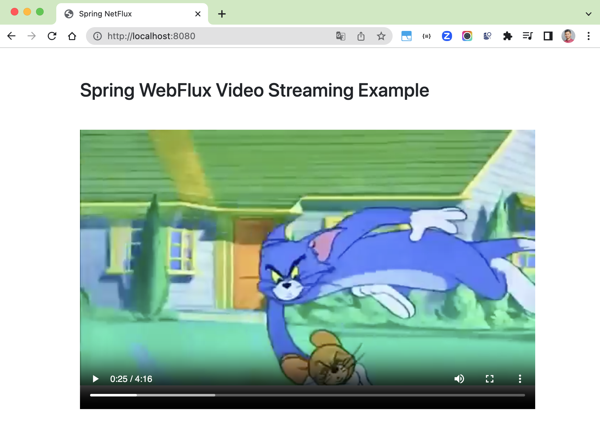
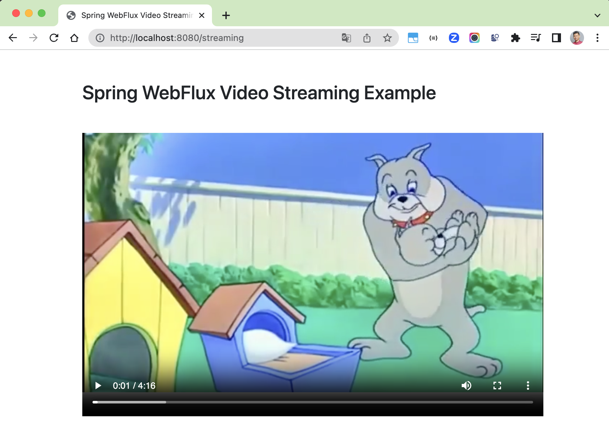
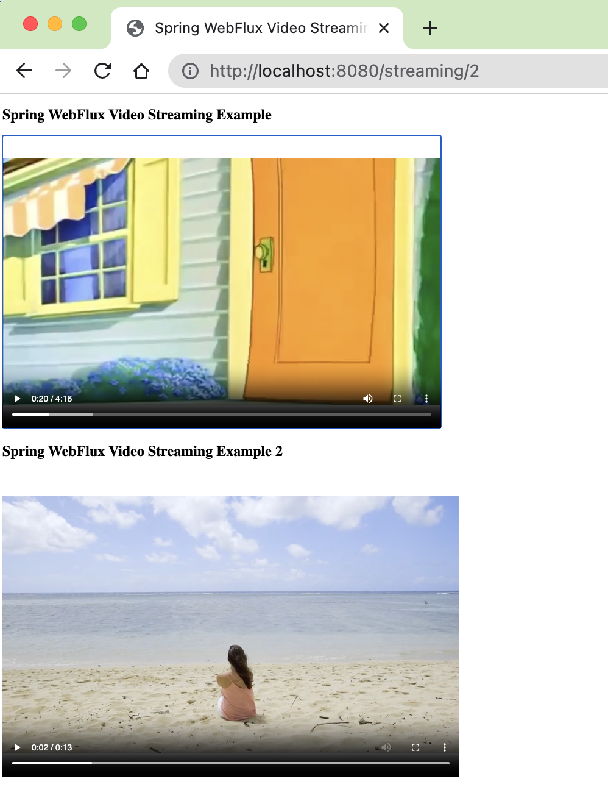

# spring-webflux-video-streaming

### Things To do list

1. Clone this repository: `git clone https://github.com/hendisantika/spring-webflux-video-streaming.git`
2. Navigate to the folder: `cd spring-webflux-video-streaming`
3. Run the application: `mvn clean spring-boot:run`
4. Open your favorite browser: http://localhost:8080 or http://localhost:8080/streaming
   or http://localhost:8080/streaming/2

### Image Screen shot

Sample 1

Sample 2

Sample 3

